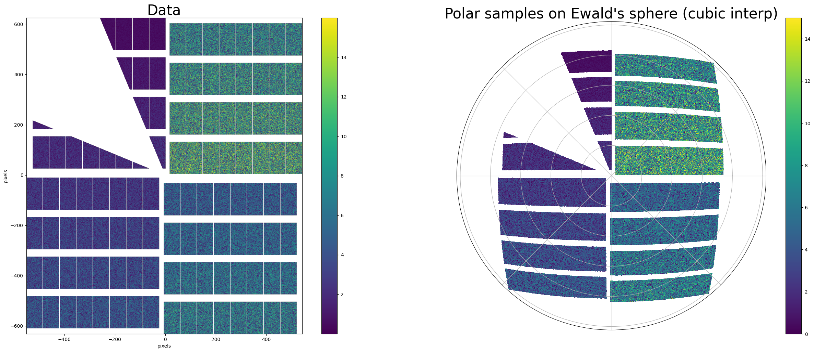
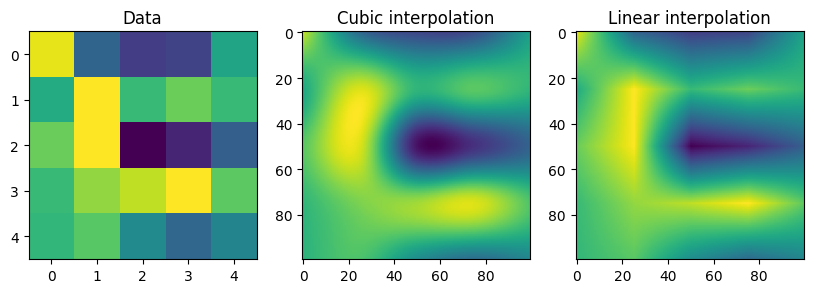

[](https://github.com/European-XFEL/static-interpolation/releases)
[](https://github.com/European-XFEL/static-interpolation/actions/workflows/tests.yml)
[](https://static-interpolation.readthedocs.io/en/latest/)
[](https://static-interpolation.readthedocs.io/en/latest/)


# static-interpolation
Fast interpolation of panelized detector data, optimized for **static sampling positions**.

## Main features
* Plan first -> execute __fast__ approach.
* Mask aware interpolation.
* Native support for panelized data
* [EXtra-geom](https://github.com/European-XFEL/EXtra-geom) integration.

## Installation
It is available on pipy so you can simply pip install the package
```bash
pip install static-interpolation
```

## Usage

### AGIPD_1M Detector & polar grid on Ewald's sphere

```python
import static_interpolation as si
from extra_geom import AGIPD_1MGeometry
from matplotlib import pyplot as plt

geom = AGIPD_1MGeometry.from_quad_positions(quad_pos=[
    (-525, 625), # in mm
    (-550, -10),
    (520, -160),
    (542.5, 475),
])

# Things that are not in geom but needed
nr,nphi = (512,2048) # polar coord shape
detector_distance = 0.2 # in meters
xray_energy = 7000 # in eV


# Instanciate the interpolator
agipd_interp = si.AGIPD_1MInterpolator.from_polar_ewald(geom,
                                         nr,
                                         nphi,
                                         xray_energy,
                                         detector_distance
										 )

# make test data
data,masks = si.utils._generate_test_data_agipd(geom,n_images=150)

# Interpolate 150 agipd patterns in one go
out,out_masks = agipd_interp(data,masks)


# Plotting
fig = si.utils._plot_agipd_test(data[0],masks[0],out[0],out_masks[0],geom,figsize=(32,12))
plt.show()
```

### General example

```python
import numpy as np
import static_interpolation as si
from matplotlib import pyplot as plt

# simple cubic interpolation using 1 panel

# generate test data
rng = np.random.RandomState(12345)
nx,ny = 5,5
n_samples = 100
n_images = 20
data = rng.random((n_images,nx,ny))


# define image layout
layout = si.data_structures.ImageLayout.from_shape((nx,ny))

# define sampling points
sampling_points = np.stack(np.meshgrid(np.arange(n_samples)*(nx-1)/n_samples,np.arange(n_samples)*(ny-1)/n_samples,indexing='ij'),axis=-1)
samples = si.data_structures.SamplingGrid(points = sampling_points[None,...],n_panels=1)

# options
options = si.config.InterpolationPolicy()
options.method = options.Method.linear

# Instanciate interpolatiors
interp_cubic = si.interpolators.StaticInterpolator(layout,samples)
interp_linear = si.interpolators.StaticInterpolator(layout,samples,options)

# Execute interpolations for all 20 images
out = interp_cubic(data)
out_linear = interp_linear(data)

# Plot Result
fig,axs = plt.subplots(1,3,figsize=(10,5))
axs[0].imshow(data[0])
axs[0].set_title("Data")
axs[1].imshow(out[0])
axs[1].set_title("Cubic interpolation")
axs[2].imshow(out_linear[0])
axs[2].set_title("Linear interpolation")
plt.show()
```
