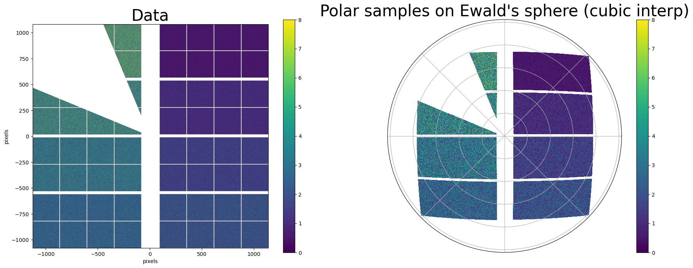

# Detectors

# AGIPD-1M
The Adaptive-Gain Integrating Pixel Detector (AGIPD) deployed at EuXFEL has a special Interpolation class
that propperly takes the double sized pixels at its ASIC boundaries into account.
```python
from static_interpolation import AGIPD_1MInterpolator
```
An example usage can be found [here](index.md#agipd-ewald-example)  
[Extra-Geom page on AGIPD](https://extra-geom.readthedocs.io/en/latest/agipd_geometry.html){target="_blank"}

# Jungfrau-4M
The Jungfrau-4M deployed at EuXFEL has a special Interpolation class
that propperly takes the double and quadruple sized pixels at its ASIC boundaries into account.
```python
from static_interpolation import JUNGFRAU_4MInterpolator
```
[Extra-Geom page on Jungfrau](https://extra-geom.readthedocs.io/en/latest/jungfrau_geometry.html){target="_blank"}  
[Paper on Jungfrau modules](https://doi.org/10.1107/S1600577526000342){target="_blank"}

/// example | Jungfrau interpolation


```python
import static_interpolation as si
from extra_geom import JUNGFRAUGeometry
from matplotlib import pyplot as plt


# Make Jungfrau geometry

# Positions are given in pixels
x_start, y_start = 1125, 1078
mod_width = (256 * 4) + (2 * 3)  # inc. 2px gaps between tiles
mod_height = (256 * 2) + 2
# The first 4 modules are rotated 180 degrees relative to the others.
# We pass the bottom, beam-right corner of the module regardless of its
# orientation, requiring a subtraction from the symmetric positions we'd
# otherwise calculate.
module_pos = [
    (x_start - mod_width, y_start - mod_height - (i * (mod_height + 33)))
    for i in range(4)
] + [
    (-x_start, -y_start + (i * (mod_height + 33))) for i in range(4)
]
orientations = [(-1, -1) for _ in range(4)] + [(1, 1) for _ in range(4)]

geom = JUNGFRAUGeometry.from_module_positions(module_pos, orientations=orientations, asic_gap=6)


# Things that are not in geom but needed
nr,nphi = (1024,4096) # polar coord shape
detector_origin = (0,0,0.2) # in meters
xray_energy = 7000 # in eV


#opt = si.config.InterpolationPolicy()
#opt.overlap_mode = opt.OverlapMode.first
# Instanciate the interpolator
agipd_interp = si.JUNGFRAU_4MInterpolator.from_polar_ewald(geom,
                                         nr,
                                         nphi,
                                         xray_energy,
                                         detector_origin
										 )

# make test data
data,masks = si.utils._generate_test_data(geom,n_images=15)

# Interpolate 150 jungfrau patterns in one go
out,out_masks = agipd_interp(data,masks)


# Plotting
fig = si.utils._plot_detector_test(data[0],masks[0],out[0],out_masks[0],geom,figsize=(32,12))
plt.show()
```
///
